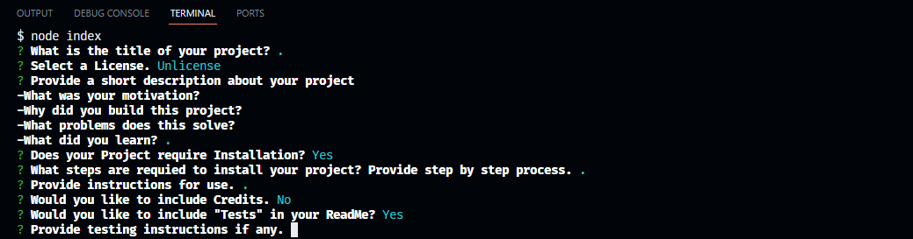

# README File Generator

[](https://opensource.org/licenses/MIT)

## Description
Empower your open-source project with a professionally-crafted README.md file using this command-line utility. With seamless integration of the Inquirer package, it transforms the process of documentation, making it effortless to share your project. The README it produces contains essential project insights, including its purpose, utilization instructions, installation procedures, reporting issues, facilitating contributions, and much more.

## Live Preview


## Table of Contents
- [Installation](#installation)
- [Usage](#usage)
- [Credits](#credits)
- [License](#license)
- [Contributing](#contributing)
- [Questions](#questions)
## Installation
Before using this application, you'll need to install the necessary dependencies. To do this, follow these steps: 
install
1. After you have cloned the repository into your local machine
navigate onto the projects root directory
2. Then run the following command.
```bash
npm i inquirer
```

## Usage
To Generate a README.md File for your project, please follow these steps

1. Open your terminal and navigate to the project's directory
2. Run the following command to start the application
```bash
node index.js
```
3. answer the prompts that appear in the command line to the best of your ability, these prompts will be questions involving about your projects including the title, description, license, usage, installation, credits, email, username, and anything else I might have missed.
4. Upon answering all prompts a README.md File will have been created.
## Credits 
https://coding-boot-camp.github.io/full-stack/github/professional-readme-guide

https://gist.github.com/lukas-h/2a5d00690736b4c3a7ba

## License 
This project is licensed under the terms of the MIT

The MIT License

[https://opensource.org/licenses/MIT](https://opensource.org/licenses/MIT)

## Contributing
If you would like to contribute to this project, please follow the guidelines outlined in the Contributing Guide.

## Questions
If you have questions or need further assistance with this project, please feel free to contact me via:
- E-Mail: CarrilloUriel81@gmail.com

- GitHub: [UCarr81](https://github.com/UCarr81)